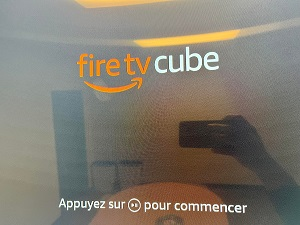

# __How to register Alexa devices on your Alex app__
<br/>


## Fire TV cube
1. Connect to TV using HDMI cable.

2. Push play/pause button on your firetv remote.

    
    <br/><br/>

3. Choose English.

    
    <br/><br/>

4. Select "Set Up with Remote"

    
    <br/><br/>

5. Connect to the Wifi

    
    <br/><br/>

6. Pick one (your amazon account ex. soap.s@smartland.com)

    
    <br/><br/>

7. Go to amazon.com/code and sign with your account.

    
    <br/><br/>

8. Regist your device code displayed on the TV screen.

    
    <br/><br/>

9. Follow the direction and set the device name. <a href='https://github.com/soapunny/docs/blob/master/reference/etc/alexa_devices_reset.md'>&rarr; Set Device Name.</a>
<br /><br />


## Smart Coffee Maker
+ Atomi Smart App Setup
    1. Download "Atomi Smart" app.

        
        <br/><br/>

    2. Click +, then select add device.

        
        <br/><br/>

    3. Select first "Smart Coffee Maker".

        
        <br/><br/>

    4. Reset the device([Reset](./alexa_devices_reset.md)) and Click "Continue".

        
        <br/><br/>

    5. Click "Go to Connection".

        
        <br/><br/>

    6. Connect to atomi-smart-xxxx on your wifi settings.

        
        <br/><br/>
        
    7. Click "Done"

        
        <br/><br/>

+ Alexa App Setup
    1. Open Amazon Alexa App, go to "More" on the bottom and click "Skills & Games".

        
        <br/><br/>

    2. Click search icon on the right-top.

        
        <br/><br/>

    3. Search "Atomi Smart".

        
        <br/><br/>

    4. Click the icon and link the "Atomi Smart".

        
        <br/><br/>

    5. Change the device name [here](./must_see-devices_naming.md).
<br /><br/>


## Google Nest Thermostat
```
> Google 
    1. Download "Nest" app.
    2. Register your thermostat.

> Alexa App Setup
    1. Open Amazon Alexa App, select more menu on the bottom and click "Skill & Games"
    2. Click search icon on the right-top and Search "Google Nest"
    3. Link the app to Alexa App.
    4. Once it's done, go to the Devices menu and search "Google Nest Thermostat"
    5. Push the "Discover Devices" button.
    6. Change the name to "Thermostat".
```
<br />


## Smart Light
<pre>
> Smart Life App Setup
    1. Download "Smart Life - Smart Living" app.
    2. Sign up for the "Smart Life" app.
    3. Open the "Smart Life" app and click "+" icon to add new device.
    4. Select "Lighting"
    5. Power on the lamp, then confirm the blinks. 
    if it doens't blink, <a href='https://github.com/soapunny/docs/blob/master/reference/etc/alexa_devices_reset.md'>Check here</a>
    6. Set your WIFI network and follow the app's guide.

> Alexa App Setup
    1. Open Amazon Alexa App, select more menu on the bottom and click "Skill & Games"
    2. Click search icon on the right-top and Search "Smart Life"
    3. Link the app to Alexa App.
    4. Once it's done, go to the Devices menu and search Smart Life light
    5. Push the "Discover Devices" button.
    6. Change the name to "Bedroom Light".
</pre>
<br />


## Echo dot
```
1. Open Amazon Alexa App, in the Devices menu on the bottom, click "Add devices".
2. Select Amazon Echo - Echo, Echo Dot, Echo Plus and more ...
3. Follow the instructions.
4. Change the name to "Echo dot".
```
<br />