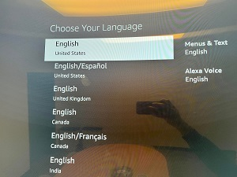
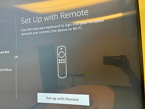
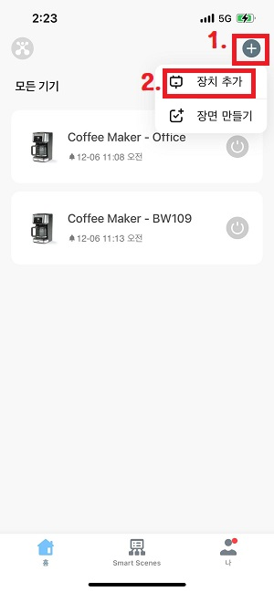
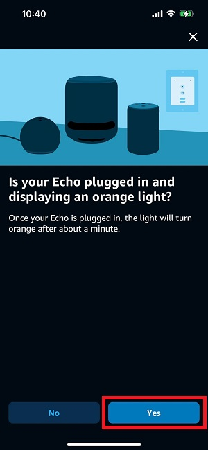

# __How to register Alexa devices on your Alex app__

 

## Index

1. [Fire TV Cube](#fire-tv-cube)
2. [Smart Coffee Maker](#smart-coffee-maker)
3. [Smart Light](#smart-light)
4. [Echo Dot](#echo-dot)
5. [Google Nest Thermostat](#google-nest-thermostat)
  

## Fire TV Cube

1. Connect to TV using HDMI cable.

2. Push play/pause button on your firetv remote.

    
      

3. Choose English.

    
      

4. Select "Set Up with Remote"

    
      

5. Connect to the Wifi

    
      

6. Pick one (your amazon account ex. soap.s@smartland.com)

    
      

7. Go to amazon.com/code and sign with your account.

    
      

8. Regist your device code displayed on the TV screen.

    
      

9. Follow the direction and set the device name. <a href='https://github.com/soapunny/docs/blob/master/reference/etc/alexa_devices_reset.md'>&rarr; Set Device Name.</a>
  

## Smart Coffee Maker

+ Atomi Smart App Setup
    1. Download "Atomi Smart" app.

        
          

    2. __[Important]__ Signing up "Atomi Smart" app, choose __“United Kingdom”__ from the Drop-down menu.
          

    3. Click +, then select add device.

        
          

    4. Select first "Smart Coffee Maker".

        
          

    5. Reset the device([Reset](./alexa_devices_reset.md)) and Click "Continue".

        
          

    6. Click "Go to Connection".

        
          

    7. Connect to atomi-smart-xxxx on your wifi settings.

        
          

    8. Click "Done"

        
          

+ Alexa App Setup
    1. Open Amazon Alexa App, go to "More" on the bottom and click "Skills & Games".

        
          

    2. Click search icon on the right-top.

        
          

    3. Search "Atomi Smart".

        
          

    4. Click the icon and link the "Atomi Smart".

        
          

    5. Change the device name [here](./must_see-devices_naming.md).
  

## Smart Light

+ Smart Life App Setup
    1. Download "Smart Life - Smart Living" app.

        
          

    2. Sign up for the "Smart Life" app.
          

    3. Open the "Smart Life" app and click "+" icon to add new device.

        
          

    4. Select "Ceiling Light(BLE+Wi-Fi)"

        
          

    5. Power on the lamp, then confirm the blinks. If it doens't blink, [click here](./alexa_devices_reset.md)

        
          

    6. Connect your phone to the WIFI hot spot starts with "SmartLife-" or "SL-" and follow the app's guide.

        
          

+ Alexa App Setup
    1. Open Amazon Alexa App, go to "More" on the bottom and click "Skills & Games".

        
          

    2. Click search icon on the right-top and Search "Smart Life"

        
          

    3. Launch the app to Alexa App.

        
          

    4. Change the device name [here](./must_see-devices_naming.md).
  

## Echo dot

1. Open Amazon Alexa App, in the "Devices" menu on the bottom, click "+" then select "Add Device".

    
      

2. Select Amazon Echo

    
      

3. Select "Echo, Echo Dot, Echo Plus and more"

    
      

4. Check your device is displaying an orange light. If it's not, [click here.](./alexa_devices_reset.md)

    
      

5. Wait for the app searching device.

    
      

6. Change the device name [here](./must_see-devices_naming.md).
  

## Google Nest Thermostat

+ Google Nest
    1. Download "Nest" app.
    2. Register your thermostat.

+ Alexa App Setup
    1. Open Amazon Alexa App, go to "More" on the bottom and click "Skills & Games".

        
          
    2. Click search icon on the right-top and Search "Google Nest"
    3. Link the app to Alexa App.
    4. Once it's done, go to the Devices menu and search "Google Nest Thermostat"
    5. Push the "Discover Devices" button.
    6. Change the name to "Thermostat".
  
