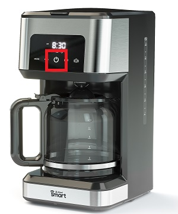
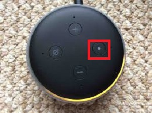

# __How to reset Alexa devices__
 

## Index

1. [Fire TV Cube](#fire-tv-cube)
2. [Smart Coffee Maker](#smart-coffee-maker)
3. [Smart Light](#smart-light)
4. [Echo Dot](#echo-dot)
5. [Google Nest Thermostat](#google-nest-thermostat)
  

## __Fire TV Cube__
1. Say "Alex, go to the settings." or Turn on the TV and go to Settings and then select the My Fire TV.

    
      

2. Select "Reset to Factory Defaults" and confirm the following alert.

    
      

3. Wait until it finish rebooting.

    
      
    
  

## __Smart Coffee Maker__
1. Press and hold the Power button for 10 seconds.

    
      

2. The WiFi indicator on the LCD panel should start flashing.
&rarr; <a href="https://manuals.plus/atomi-smart/atomi-smart-at1528-coffee-maker-user-guide#ixzz7mENuxAax">Read More</a>
  

## __Smart Light__
1. Turn on and off 3 times.
2. Then turn on the lamp, after 4 seconds.
3. Check lamp blinks rapidly.
4. Then turn it off, on, off, on and off.
5. Then turn on the lamp, after 4 seconds.
6. Check lamp blinks slower.
  

## __Echo Dot__
1. Press and hold the Action button for 20 seconds.

    
      
2. Wait for the light ring to turn off and on again.
3. Your device enters setup mode.
  

## __Google Nest Thermostat__
1. Go to "Settings" or "Nest Settings" and then select "Reset" or "Factory Reset".
2. Your thermostat will ask you to confirm your choice.
3. Once you’ve confirmed, your thermostat will take a few moments to restart or reset.
  