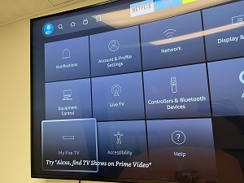

# __How to reset Alexa devices__
<br />

## __Fire TV cube__

1. Say "Alex, go to the settings." or Turn on the TV and go to Settings and then select the My Fire TV.

    
    <br/><br/>

2. Select "Reset to Factory Defaults" and confirm the following alert.

    
    <br/><br/>

3. Wait until it finish rebooting.

    
    <br/><br/>

4. Push play/pause button on your firetv remote.

    
    <br/><br/>

5. Choose English.

    
    <br/><br/>

6. Select "Set Up with Remote"

    
    <br/><br/>

7. Connect to the Wifi

    
    <br/><br/>

8. Pick one (your amazon account ex. soap.s@smartland.com)

    
    <br/><br/>

9. Go to amazon.com/code and sign with your account.

    
    <br/><br/>

10. Regist your device code on 9.

    
    <br/><br/>

11. Follow the direction and set the device name [DeviceName] - [BuildingName][UnitNumber]. 
```
    //Examples
    Fire TV Cube - BW109
    Fire TV Cube - WG229
```

<br /><br />

## Smart Coffee Maker
<pre>
1. Press and hold the Power button for 10 seconds. 
2. The WiFi indicator on the LCD panel should start flashing.

>> <a href="https://manuals.plus/atomi-smart/atomi-smart-at1528-coffee-maker-user-guide#ixzz7mENuxAax">Read More</a>
</pre>
<br />

## Google Nest Thermostat
```
1. Go to Settings Nest settings and then select Factory Reset. 
2. Your thermostat will ask you to confirm your choice. 
3. Once you’ve confirmed, your thermostat will take a few moments to restart or reset.
```
<br />

## Smart light
```
1. Turn on and off the light 3 times
2. Then turn on the lamp, after 4 seconds.
3. Check lamp blinks rapidly.
```
<br />

## Echo dot
```
1. Press and hold the Action button for 20 seconds.
2. Wait for the light ring to turn off and on again.
3. Your device enters setup mode. For setup instructions, go to Set Up Your Echo Dot.
```
<br />