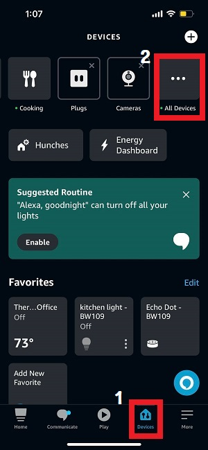
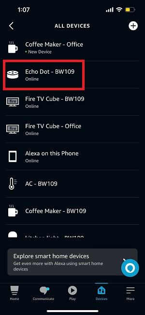
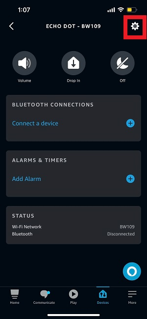

# __Device Naming__

## Naming Steps.

1. Open the Amazon - Alexa app.

2. Select the Devices on the bottom and Click the "All Devices".

    
    <br/><br/>

3. Choose the device you want to change it's name.

    
    <br/><br/>

4. Click the settings icon.

    
    <br/><br/>
    
5. Click "Edit Name", change it's name and push "return".

    
    <br/><br/>


## Naming Rule.
[BuildingName][UnitNumber] - [DeviceName].
```
    //Examples
    BW109 - Fire TV Cube
    WG229 - Echo Dot
    SW119 - Coffee Maker 
    SW117 - Thermostat
    PG2105 - Bedroom Light
    PG2105 - Kitchen Light
```
<br/>