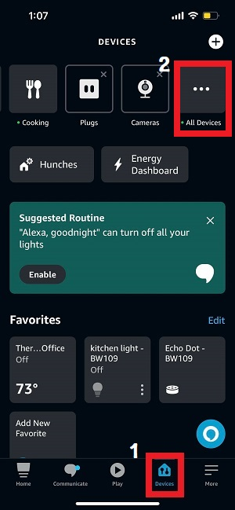
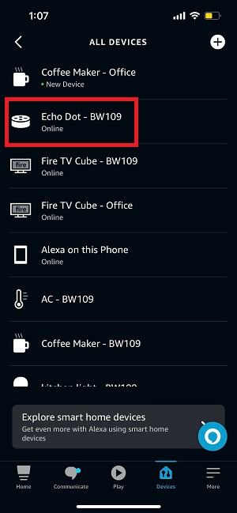
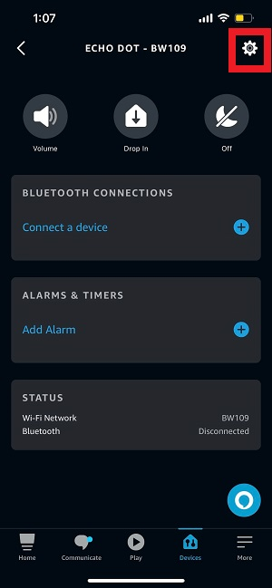
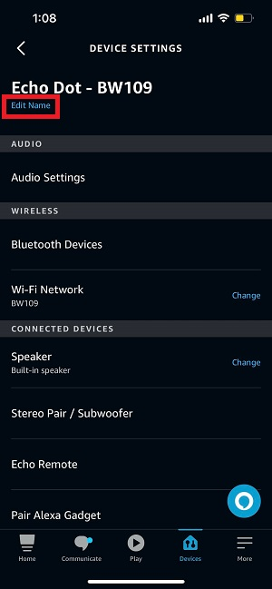

# __Device Naming__

## Naming Steps.

1. Open the Amazon - Alexa app.

2. Select the Devices on the bottom and Click the "All Devices".

    
    <br/><br/>

3. Choose the device you want to change it's name.

    
    <br/><br/>

4. Click the settings icon.

    
    <br/><br/>
    
5. Click "Edit Name", change it's name and push "return".

    
    <br/><br/>


## Naming Rule.
[DeviceName] - [BuildingName][UnitNumber].
```
    //Examples
    Fire TV Cube - BW109
    Echo dot - WG229
    Coffee Maker - SW119
    Bedroom Light - PG2105
```
<br/>